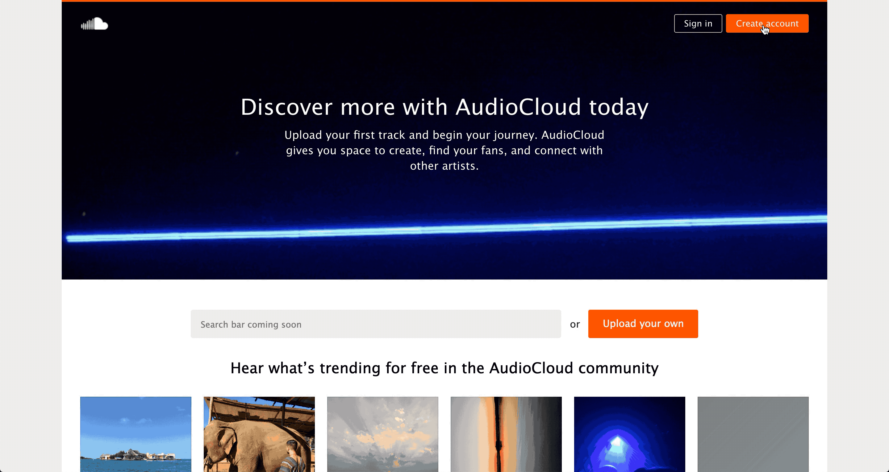
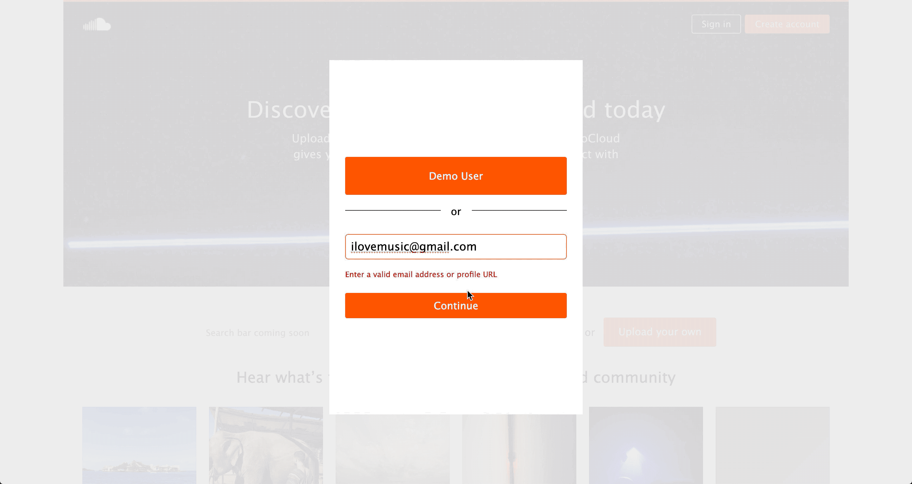
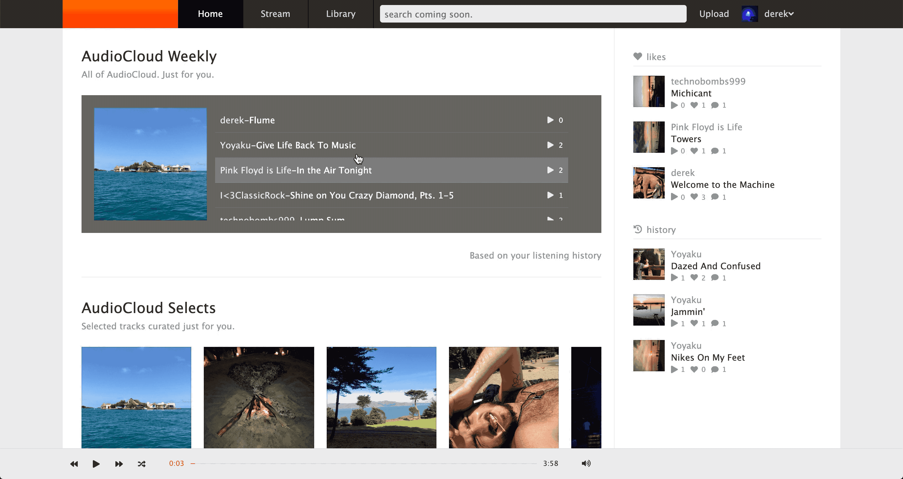
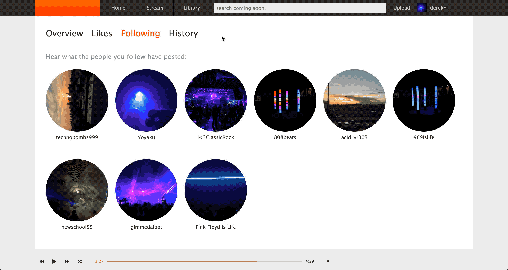
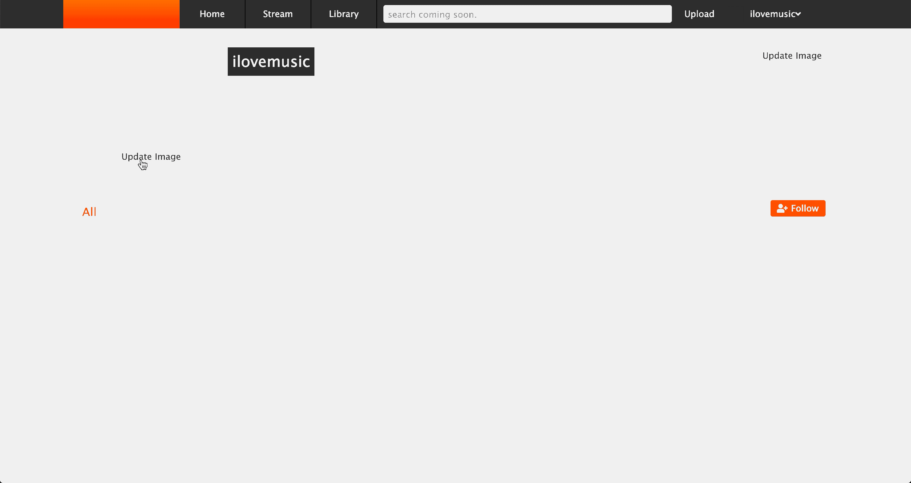
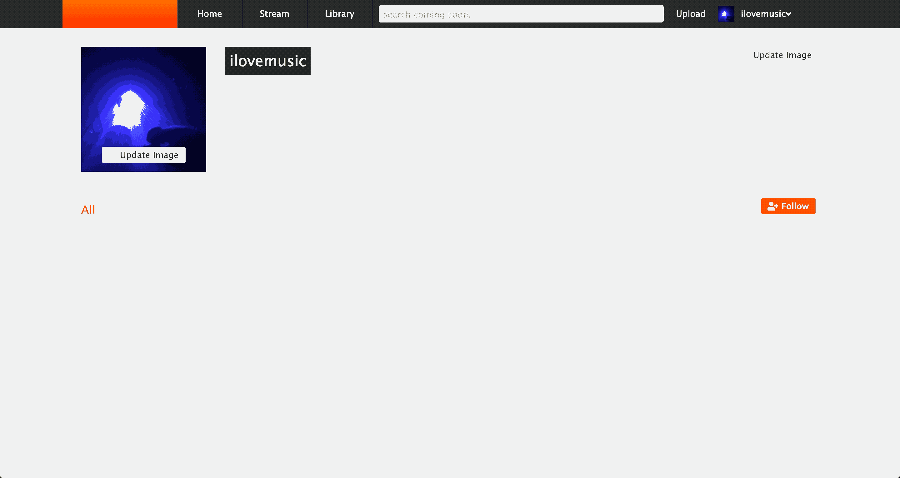
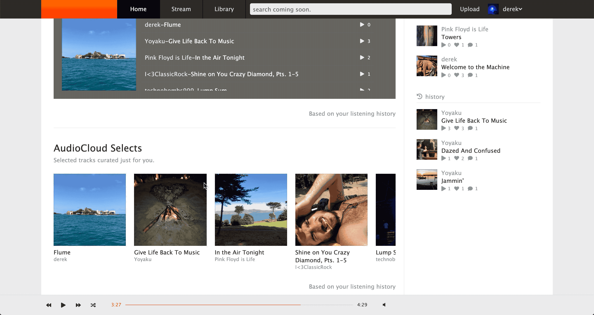
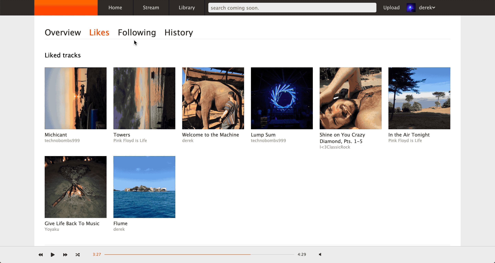
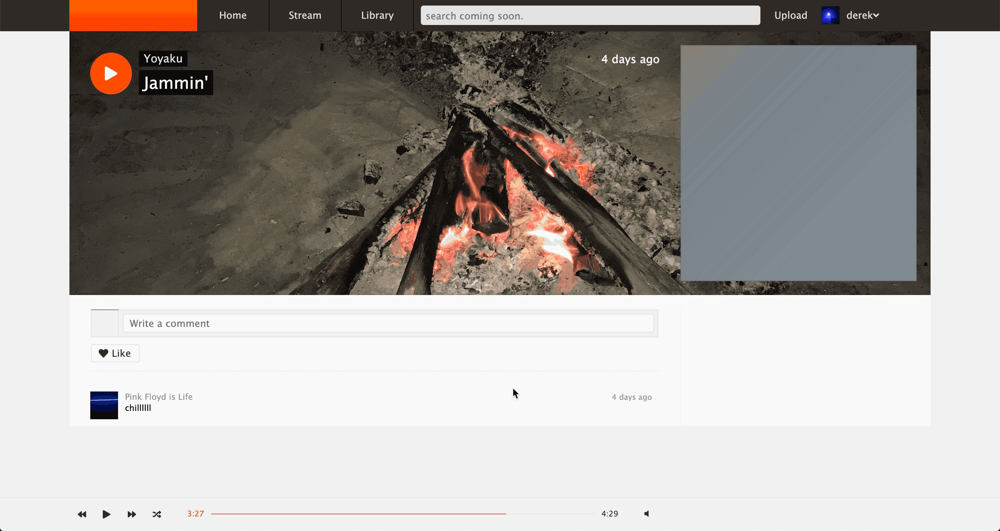
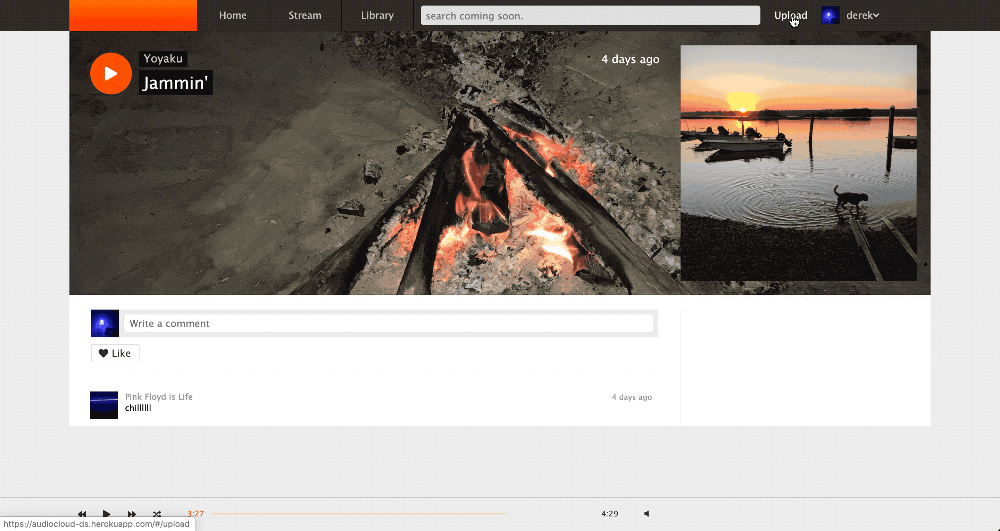

welcome to audiocloud.

https://audiocloud-ds.herokuapp.com/#/discover

this site is my version of the artist adored music discovery application, SoundCloud.

this is my first independently-driven, full-stack project as a developer. 

technologies used include:

React-Redux  ( frontend )
Ruby on Rails  ( backend )
AWS  ( data hosting )
Postgresql  ( database management )
Heroku  ( domain hosting )

audiocloud's development and design are ongoing.

thank you for coming. 

Selected features

- continuous play music bar
allows users to enjoy an uninterrupted listening experience throughout the application. achieved by leveraging a modular React component, maintaining it's own mutable state, in combination with a selective Redux store, ensuring singular audio playback*.

- track upload
allows users to upload audio (and image) files for immediate playback and sharing. achieved using FormData javascript objects to handle data transfer via AJAX post request to custom rails backend, persisting data both locally in postgresql, and remotely via ActiveRecord associations to AWS blobs.  

*see below for a dive into challenges overcome during development.

Future features and direction
- social
- custom music tagging
- audio waveforms
- personalized playlists
- departure from SoundCloud

Challenges faced
in order to maintain continuous music playback, the HTMLAudioElement was used. one quirk that arose during development was the ability for multiple HTMLAudioElements to playback music at the same time, despite only one HTMLAudioElement living in the component's (and by extension, the entire application's) state. 

my solution was to take advantage of React's Lifecycle methods: shouldComponentUpdate and componentDidUpdate. in the former, we ensure current state - an HTMLAudioElement - is paused; then, in the latter, a new HTMLAudioelement is constructed, set to state, and playback begins. 

single source of truth.

### Splash Page

### User Authentication

### Continuous Play Music Bar

### Recent Plays Feature

### User Dashboard

### Likes Feature

### Follows Feature

### Comments Feature

### Uploads

### Stream
