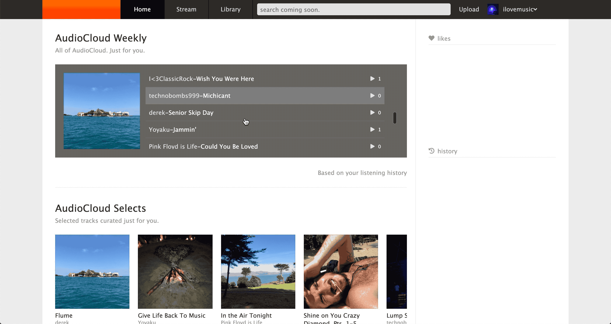

# Welcome to [AudioCloud](https://audiocloud-ds.herokuapp.com/#/).

This is my rendition of the artist adored music discovery application, [SoundCloud](https://soundcloud.com).

This is my first independently-driven, full-stack project as a developer. 

**Technologies used include**:

- *React-Redux*  ( frontend )
- *Ruby on Rails*  ( backend )
- *AWS*  ( data hosting )
- *Postgresql*  ( database management )
- *Heroku*  ( domain hosting )
- *WaveSurfer.js*  ( 3rd party library )


AudioCloud's development and design are ongoing.

Thank you for coming. 
***

## Selected Features

### Splash Page
Users are greeted with an eye-catching landing page. 


***
### User Authentication
Implemented a multi-step login / signup process.


***
### **Highlighted feature** *(Code Snippet below)*: Continuous Play Music Bar 
Built from scratch, using HTML and CSS.


Allows users to enjoy an uninterrupted listening experience throughout the application. Achieved using a modular React component, maintaining it's own mutable state, in combination with a selective Redux store, ensuring singular audio playback*:

```javascript
   handleProgressDrag(e) {
        e.preventDefault();
        
        const progress = document.getElementById("cpb-timeline-progress-bg").getBoundingClientRect();
        const filler = document.getElementById("cpb-timeline-progress-timepassed");
        const handle = document.getElementById("cpb-timeline-progress-handle");
        const timeshow = document.getElementById("cpb-timeline-timepassed-show");
        const currentTrack = document.getElementById("currentTrack");
        


        let amount;

        if (e.clientX < progress.left) {
            amount = "0%";
        } else if (e.clientX > progress.right) {
            amount = "100%";
        } else {
            amount = (((e.clientX - progress.left) / progress.width) * 100) + "%";
        }

        const time = (currentTrack.duration * parseFloat(amount)) / 100;


        const currentTimeMin = Math.floor((time) / 60);
        const currentTimeSec = (
            Math.floor(time % 60) < 10 ?
                ("0" + Math.floor(time % 60)) : Math.floor(time % 60)
        );
        const currentTimeObj = `${currentTimeMin + ":" + currentTimeSec}`;

        if (e.clientX !== 0) {
            handle.style.left = amount;
            filler.style.width = amount;
            timeshow.innerHTML = currentTimeObj;
        }
        const newState = Object.assign({}, this.state, { drag: true });
        this.setState(newState); 
    }

    handleProgressDragEnd(e) {
        const currentTrack = document.getElementById("currentTrack");
        const progress = document.getElementById("cpb-timeline-progress-bg").getBoundingClientRect();
        const filler = document.getElementById("cpb-timeline-progress-timepassed");
        const handle = document.getElementById("cpb-timeline-progress-handle");

        let amount;

        if (e.clientX < progress.left) {
            amount = "0%";
        } else if (e.clientX > progress.right) {
            amount = "100%";
        } else {
            amount = (((e.clientX - progress.left) / progress.width) * 100) + "%";
        }

        currentTrack.currentTime = (parseFloat(amount) * currentTrack.duration) / 100;

            handle.style.left = amount;
            filler.style.width = amount;
    
        const newState = Object.assign({}, this.state, { drag: false });
        this.setState(newState); 
    }

    handleProgressMouseUp(e) {
        const currentTrack = document.getElementById("currentTrack");
        const progress = document.getElementById("cpb-timeline-progress-bg").getBoundingClientRect();
        const filler = document.getElementById("cpb-timeline-progress-timepassed");
        const handle = document.getElementById("cpb-timeline-progress-handle");

        let amount;

        if (e.clientX < progress.left) {
            amount = "0%";
        } else if (e.clientX > progress.right) {
            amount = "100%";
        } else {
            amount = (((e.clientX - progress.left) / progress.width) * 100) + "%";
        }

        currentTrack.currentTime = (parseFloat(amount) * currentTrack.duration) / 100;

        handle.style.left = amount;
        filler.style.width = amount;

        const newState = Object.assign({}, this.state, { drag: false });
        this.setState(newState); 
    }
```

*see below for a dive into challenges overcome during development.

***
### Recent Plays Feature
Upon playing a track, will immediately display in History. Built using a Recent Play association in the Rails backend, indexed on user_id and track_id. If association already exists, 1: destroy; 2: create new; 3: send new record to frontend with new timestamp.



***
### User Dashboard
Artists have a public profile where users can find their uploaded tracks. 


Users can customize their avatar,


and their header image. 


***
### Likes Feature
Users can like songs from anywhere throughout the app. Will immediately appear in Likes section of Library.


***
### Uploads
Built using AWS, users can upload tracks for immediate playback.


***
### Follows Feature
Users can follow artists. Artists' tracks will immediately appear in Stream.


***
### Stream


***
### Comments CRUD Feature
Users can comment on tracks, read other artists' comments, and delete only their own.


***
## Future features and direction

- ~~social~~
> I decided to tackle this straight away in order to gain experience working in the backend - one of the challenges faced was figuring out how to implement a self-joins table (Follows). Resourcefully, I implemented the most efficient solution I found. 
- custom music tagging
- audio waveforms
- personalized playlists
- departure from SoundCloud

***
## Challenges faced

- In order to maintain continuous music playback, the HTMLAudioElement was used. One quirk that arose during development was the ability for multiple HTMLAudioElements to playback music at the same time, despite only one HTMLAudioElement living in the component's (and by extension, the entire application's) state. 

- My solution was to take advantage of React's Lifecycle methods: shouldComponentUpdate and componentDidUpdate. In the former, we ensure current state - an HTMLAudioElement - is paused; then, in the latter, a new HTMLAudioelement is constructed, set to state, and playback begins. 

Single Source of Truth.